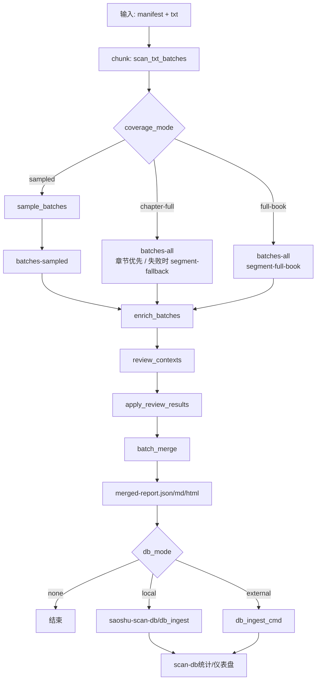
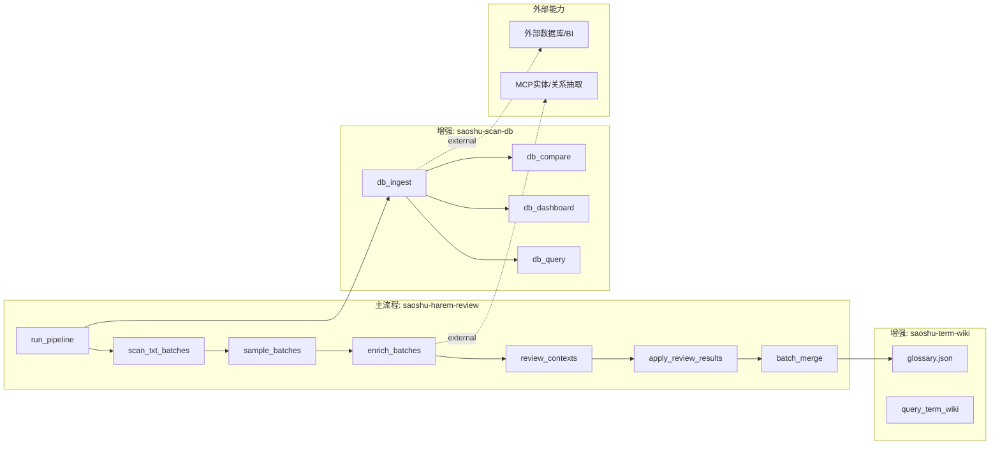

# 扫书系统蓝图（全盘梳理）

## 1. 目标与产出
目标：
- 让用户快速获得“可看/慎入/劝退”决策。
- 让团队能稳定复用流程并持续扩展能力。

核心产出：
- `merged-report.json`（真源）
- `merged-report.md`
- `merged-report.html`
- 可选：`scan-db/*`（统计与可视化）

## 2. 端到端流程图


- 用户入口优先理解 `coverage_mode=sampled|chapter-full|full-book`。
- `pipeline_mode=economy|performance` 仍保留为兼容执行层：`sampled -> economy`，`chapter-full / full-book -> performance`。

## 3. 架构图（能力拆分）


## 4. 功能清单分层（必须 vs 可选增强）
### 4.1 主流程必须功能（不可缺）
1. 输入解析与章节切分（含编码回退）。
2. 分批扫描与风险初判（雷点/郁闷点/待补证）。
3. 复核包生成与回填机制（证据闭环）。
4. 归并输出 JSON/MD/HTML。
5. 运行状态记录（`pipeline-state.json`）。

### 4.2 强烈建议功能（默认应开）
1. `sampled / chapter-full / full-book` 三档 coverage-first 入口；`economy / performance` 仅作为兼容执行层保留。
2. `sampled` 路径的 dynamic 抽查与 auto 档位推荐。
3. 报告审计面板（过程可追溯）。
4. 术语百科接入（新人可读性）。

### 4.3 可选增强功能（按场景开）
1. 外部 MCP 增强（角色/关系/标签）。
2. 数据库入库与统计看板。
3. 多维对比（作者/标签/结论/模式）。
4. 外部 DB/BI 对接（团队化分析）。

## 5. 当前已具备能力
- 长文本分批扫描，支持 GB18030/GBK。
- 动态抽样与档位自动推荐。
- 多格式报告 + 审计面板。
- 术语速查与 HTML 悬浮释义。
- 本地数据库入库、查询、仪表盘、多维对比。

## 6. 当前缺口（建议补齐）
1. 没有统一 CLI 入口（目前脚本较多，新手门槛偏高）。
2. 报告缺“置信度分数”统一定义（只有证据等级，缺可量化置信区间）。
3. 缺少批量任务队列（多本书连续跑要手工写循环）。
4. 缺少数据版本迁移工具（schema 变更后的旧库兼容策略）。
5. 缺少自动测试集（目前以样本实跑为主，回归保护不足）。

## 7. 可用性/易用性提升建议（优先级）
### P0（应优先）
1. 增加 `saoshu-cli` 统一入口（`scan`, `compare`, `dashboard`, `wiki` 子命令）【已完成】。
2. 提供 manifest 向导生成器（交互式填写必要字段）【已完成】。
3. 报告首页增加“新手模式摘要卡”（3行结论 + 风险红黄绿）【已完成】。

### P1
1. 增加批量任务清单执行（YAML/JSON list）【已完成】。
2. 给数据库看板加时间趋势图（按日期/作者/标签）【已完成】。
3. 报告支持一键导出 PDF（带目录与页眉页脚）【基础版已完成：HTML->PDF】。

### P2
1. 增加角色关系可视图（关系图谱）【P2-1 已完成：跨平台本地 + 角色名归一化 + 弱边剪枝 + 前端筛选】。
2. 支持团队协作标注与复核审批流。
3. 支持远端对象存储归档（报告与数据库快照）。

## 8. 推荐默认配置（面向普通用户）
```json
{
  "coverage_mode": "sampled",
  "pipeline_mode": "economy",
  "sample_mode": "dynamic",
  "sample_level": "auto",
  "sample_strategy": "risk-aware",
  "wiki_dict": "",
  "db_mode": "local",
  "db_path": "./scan-db"
}
```

- 普通用户默认先按 `coverage_mode=sampled` 理解；`pipeline_mode=economy` 是当前兼容执行层映射。
- 需要更高覆盖时，优先升级到 `chapter-full`；需要最终确认或绕开章节前置时，再升级到 `full-book`。

## 9. 最小操作路径（新人）
1. 准备 manifest（可复制示例改 5 个字段）。
2. 运行 `run_pipeline --stage all`。
3. 打开 `merged-report.html` 看结论与术语释义。
4. 运行 `db_dashboard` 看历史统计。
